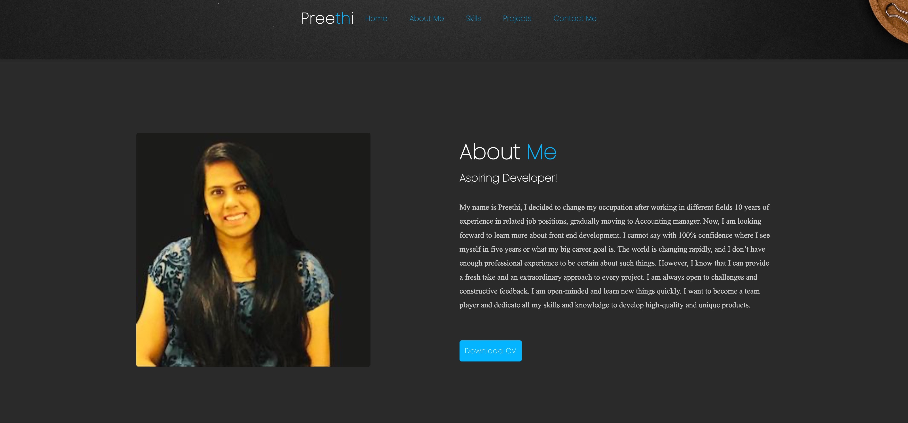

# My Personal Portfolio 📨

> This is my personal portfolio website built using HTML, CSS. The main aim of
> the website is showcases my skills and projects as an aspiring junior
> front-end developer, including my education, and previous work experience.

## Table of contents 📚

- [My Personal Portfolio 📨](#my-personal-portfolio-)
  - [Table of contents 📚](#table-of-contents-)
  - [General info ℹ](#general-info-ℹ)
  - [Screenshots 📷](#screenshots-)
  - [Technologies 👩‍💻](#technologies-)
  - [Setup 🖥](#setup-)
  - [Code Examples 👩‍💻](#code-examples-)
  - [Status 🚀](#status-)
  - [Inspiration 🌟](#inspiration-)
  - [Contact 📱](#contact-)
  - [Instructions for use](#instructions-for-use)
  - [Code Quality Checks](#code-quality-checks)
  - [Continuous Integration (CI)](#continuous-integration-ci)
  - [Repo Setup](#repo-setup)

## General info ℹ

> A website of portfolio build to give small introduction about myself, work
> using agile methodology, html,css.

## Screenshots 📷



## Technologies 👩‍💻

- HTML
- CSS
- VSC code
- npm

## Setup 🖥

- `npm run start`

## Code Examples 👩‍💻

```html
<div class="contact-form">
  <form action="">
    <input type="name" placeholder="Your Name" required />
    <input type="email" placeholder="Your Email" required />
    <input type="number" placeholder="Your Mobile Number" required />
    <textarea
      name=""
      id=""
      cols="35"
      rows="10"
      placeholder="How Can I Help You"
      required
    ></textarea>
    <input type="submit" value="Send Message" class="submit" required />
  </form>
</div>
```

```css
.top i {
  padding: 10px;
  border-radius: 8px;
  font-size: 15px;
  color: var(--text-color);
  background: var(--main-color);
}
```

## Status 🚀

Project is: _Done_

## Inspiration 🌟

- Project code inspired by

1. angela (app brewery)
2. codehal you tube channel
3. code with harry
4. itech eazy code

## Contact 📱

| Name           |                                      |
| -------------- | ------------------------------------ |
| Preethi Tapati | (<https://github.com/PreethiTapati>) |

## Instructions for use

<details>
  <summary>Getting Started</summary>

<!-- a guide to using this repository -->

1. `git clone git@github.com:HackYourFutureBelgium/template-markdown.git`
2. `cd template-markdown`
3. `npm install`

## Code Quality Checks

- `npm run format`: Makes sure all the code in this repository is well-formatted
  (looks good).
- `npm run lint:ls`: Checks to make sure all folder and file names match the
  repository conventions.
- `npm run lint:md`: Will lint all of the Markdown files in this repository.
- `npm run lint:css`: Will lint all of the CSS files in this repository.
- `npm run validate:html`: Validates all HTML files in your project.
- `npm run spell-check`: Goes through all the files in this repository looking
  for words it doesn't recognize. Just because it says something is a mistake
  doesn't mean it is! It doesn't know every word in the world. You can add new
  correct words to the [./.cspell.json](./.cspell.json) file so they won't cause
  an error.
- `npm run accessibility -- ./path/to/file.html`: Runs an accessibility analysis
  on all HTML files in the given path and writes the report to
  `/accessibility_report`

## Continuous Integration (CI)

When you open a PR to `main`/`master` in your repository, GitHub will
automatically do a linting check on the code in this repository, you can see
this in the[./.github/workflows/lint.yml](./.github/workflows/lint.yml) file.

If the linting fails, you will not be able to merge the PR. You can double check
that your code will pass before pushing by running the code quality scripts
locally.

## Repo Setup

- Give each member **_write_** access to the repo (if it's a group project)
- Turn on GitHub Pages and put a link to your website in the repo's description
- Turn on GitHub Actions
- In _General_ Section > check **Discussions**
- In the _Branches_ section of your repo's settings make sure the
  `master`/`main` branch must:
  - "_Require a pull request before merging_"
  - "_Require approvals_"
  - "_Dismiss stale pull request approvals when new commits are pushed_"
  - "_Require status checks to pass before merging_"
  - "_Require branches to be up to date before merging_"
  - "_Do not allow bypassing the above settings_"

</details>
